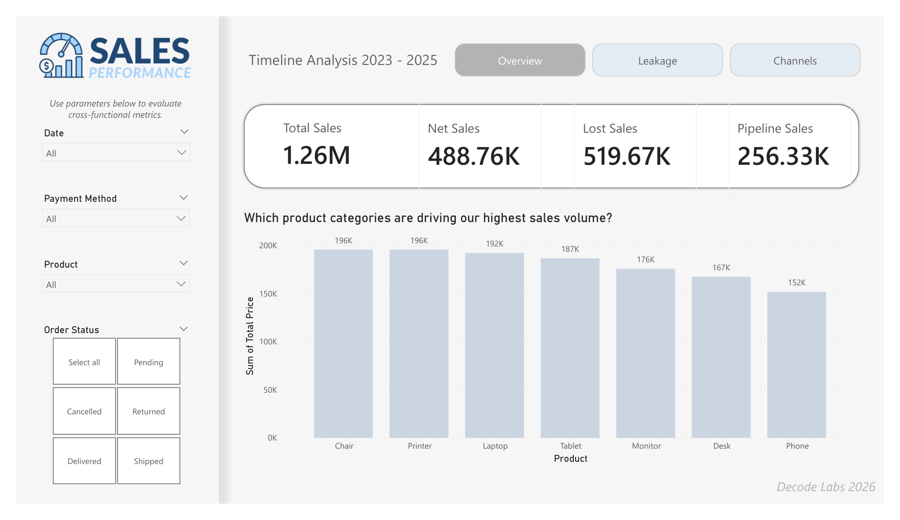
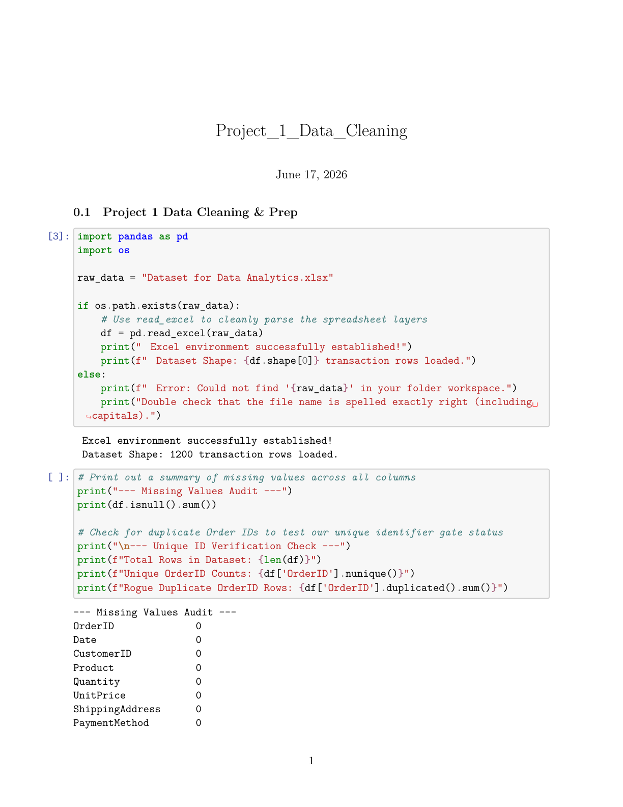
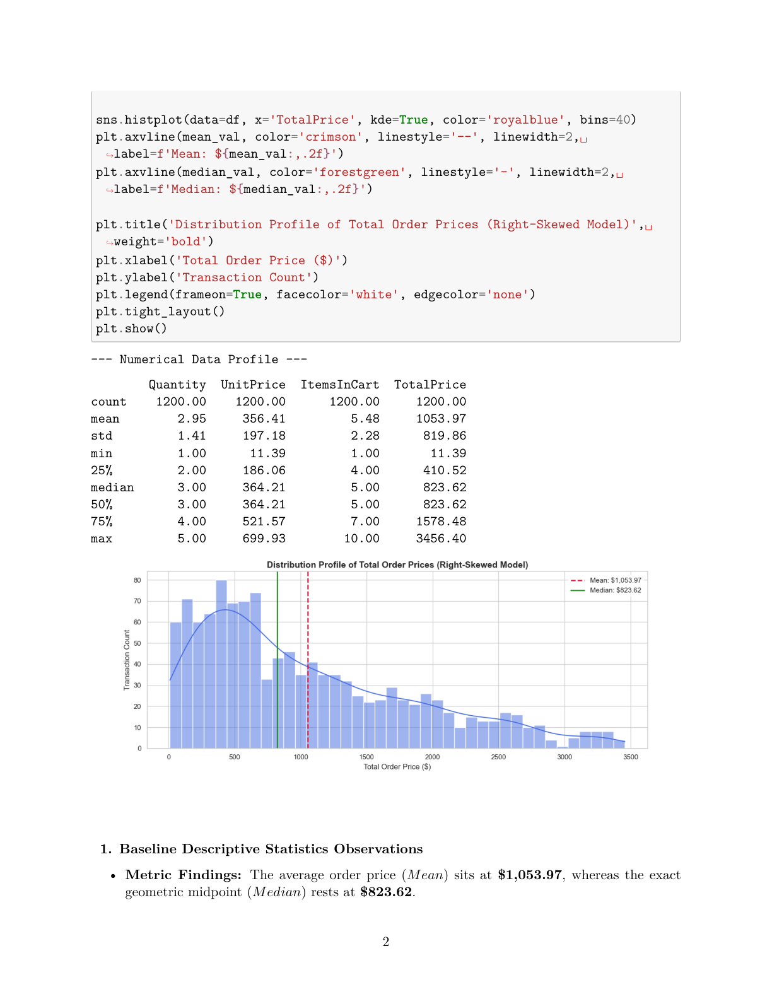
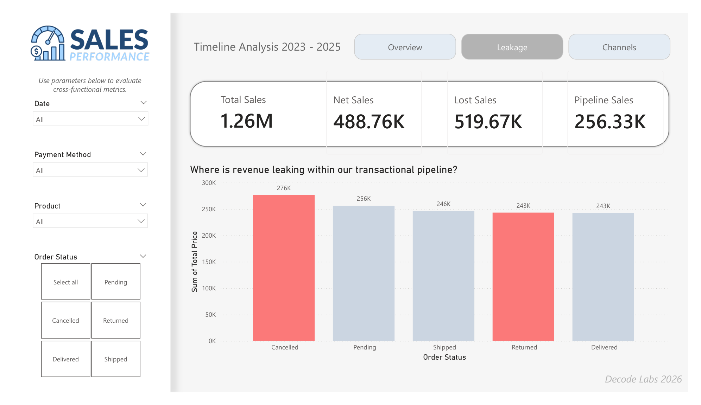
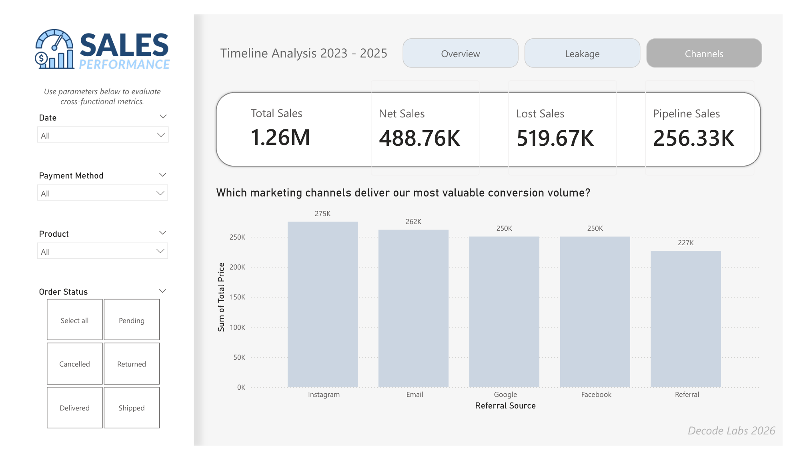

  

<h1 align="center">Commercial Performance Analytics Platform</h1>

  <strong>End-to-End Revenue Lifecycle Optimization & Business Intelligence Systems</strong>
   
  Developed for <a href="https://www.decodelabs.tech/index.html" target="_blank"><strong>Decode Labs Industrial Training Program</strong></a>

  
  
  
  
  

---

<h2 align="center">The Problem</h2>

  

  <em>Siloed spreadsheet archives lacked relational mapping and suffered from systematic transaction anomalies.</em>

<blockquote>
  💥 <strong>The Business Impact:</strong> Raw transactional logs were trapped in loose unindexed flat files. Critical revenue streams suffered from unmonitored baseline leakages, hidden duplication spikes, and loose marketing attribution layers—leaving corporate stakeholders completely blind to asset performance and marketing channel ROI.
</blockquote>

---

<h2 align="center">The Solution</h2>

  

  <em>An integrated 4-phase data platform translating dirty raw data inputs into clean, query-optimized executive engines.</em>

---

<h2 align="center">The Analytics Architecture</h2>

### 🧼 Phase 1: High-Integrity Cleaning Gate (`Project_1`)

* Programmatically verified all 1,200 transaction rows for missing value gaps and schema anomalies.
* Implemented clean parsing protocols to force uniform customer identifiers and remove duplicate string spaces.

### 📊 Phase 2: Exploratory Outlier Profiling (`Project_2`)

* Evaluated non-parametric distribution statistics to capture hidden operational behaviors.
* Configured mathematical Interquartile Range (IQR) fences to isolate and track high-value transaction outliers.

### 🗄️ Phase 3: In-Memory SQLite Core (`Project_3`)

* Structuralized a relational data schema running an optimized in-memory database instance.
* Executed conditional queries using custom index configurations and `HAVING` clause filters to extract high-ticket items.

### 🎨 Phase 4: High Data-Ink Visual Storytelling (`Project_4`)

* Built matching interactive presentation dashboard views in both Python and Power BI Desktop.
* Standardized a slate-and-blue palette, eliminated redundant gridlines, and used question-based titles.

---

<h2 align="center">Verified Project Metrics</h2>

  

| Metric Layer                 | Data Definition             | Corporate Application                     | Verified Value          |
| :--------------------------- | :-------------------------- | :---------------------------------------- | :---------------------- |
| 💰**Gross Revenue**    | Full Ingested Pipeline      | Total gross value of incoming orders      | **$1,264,761.96** |
| 🛑**Revenue Leakage**  | Canceled & Returned Baskets | Total capital lost to systematic friction | **$519,673.91**   |
| ✅**Realized Revenue** | Completed Deliveries        | Net cash secured via shipped logistics    | **$488,759.90**   |
| ⏳**Pipeline Sales**   | Active Transit Logs         | Processing capital remaining in transit   | **$256,328.15**   |

---

<h2 align="center">Executive Narrative Insights</h2>

  

  <strong>1. Product Mix:</strong> <em>Which product categories are driving our highest sales volume?</em> 
  Chairs ($195.6K) and Printers ($195.6K) stand out as foundational commercial anchors, combining for over <strong>$391K</strong> in total gross sales.

 

  

  <strong>2. Operational Risk:</strong> <em>Where is revenue leaking within our transactional pipeline?</em> 
  A critical <strong>41.1% revenue leakage</strong> is detected due to canceled ($276K) and returned ($243K) orders, highlighting an urgent need for fulfillment optimization.

 

  

  <strong>3. Strategic Resolution:</strong> <em>Which marketing channels deliver our most valuable conversion volume?</em> 
  Instagram dominates all acquisition paths at <strong>$275K</strong>. Capital allocation models recommend centering Q3 performance marketing budgets around Instagram and Email.

---

<h2 align="center">Repository Structure</h2>

<pre>
DecodeLabs-Internship/
├── Project_1_Data_Cleaning.ipynb    # Automated Preprocessing Script
├── Project_2_EDA.ipynb              # Outlier Isolation & Data Profiling
├── Project_3_SQL.ipynb              # In-Memory Relational Processing Engine
├── Project_4_Dashboard.pbix         # Power BI Interactive Application
├── extract_assets.py                # Automated Asset Extraction Script
├── DecodeLabs-Internship/           # Nested Directory containing extracted images
│   └── docs/                        
│       └── images/                  # Extracted Visual Report Assets (.png)
├── Resources/                       # High-Integrity File Repositories
│   ├── Clean_Dataset_Data_Analytics.csv # Audited Production Database
│   └── Data Analytics Project 4.pdf     # Module Spec Framework
└── README.md                        # Executive Landing Page (This File)
</pre>

---

  <strong><a href="https://www.decodelabs.tech/index.html" target="_blank">Decode Labs Industrial Training Program</a></strong> 
  Data Analytics Engineering Track Portfolio · 2026

  <a href="Project_4_Dashboard.pbix">Launch Power BI Application</a> · <a href="Resources/Clean_Dataset_Data_Analytics.csv">Explore Cleansed Database</a>

